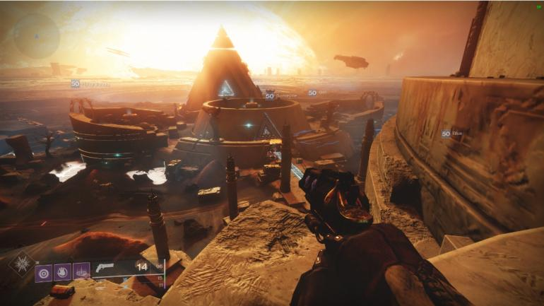

# Alex Cherry Final Year Project
My 4th Year Project for Software Development in GMIT.

## Entropy
The idea of this game is to be a first person shooter developed in Unity 3D. It will feature a single-player gamemode, a multi-player game mode and a co-operative game mode in future. 

### Map Inspiration 

All credits go to https://www.bungie.net/ for map design and https://www.gamepur.com/guide/41563-destiny-2-lighthouse-mercury-location-lumina-quest.html for image source

