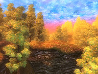

# Alex Cherry Final Year Project
My 4th Year Project for Software Development in GMIT.

## Entropy
The idea of this game is to create a 3rd person Open World RPG in Unity 3D.

### Map Inspiration 

All credits go to https://elderscrolls.bethesda.net/en/oblivion for map design and https://en.uesp.net/wiki/Oblivion:Painted_World for image source

