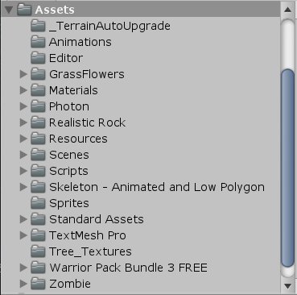
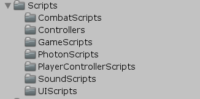
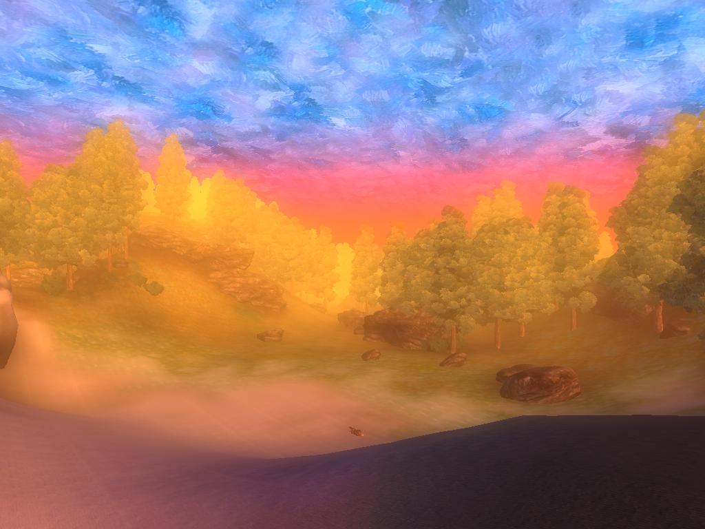
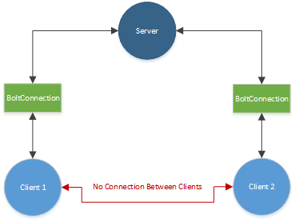
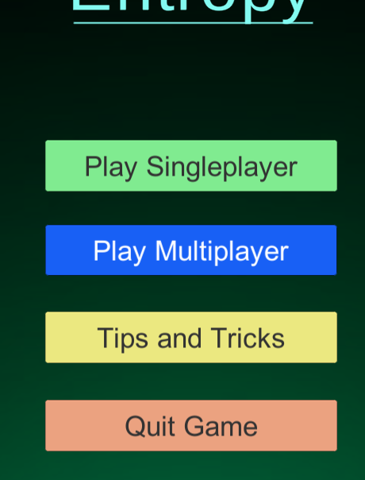
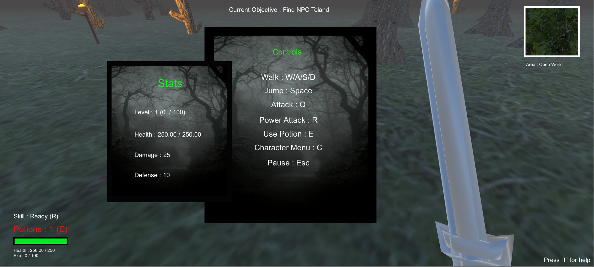
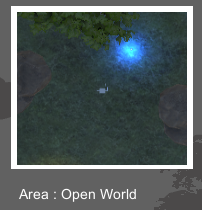

# Entropy
A First-Person Open World RPG developed in Unity.

## Authors : 
[Alex Cherry](https://github.com/moecherry99)

## Project Supervisor : 
[Dr. Dominic Carr](https://github.com/dominiccarr)

### Requirements : 
Windows/Mac/Linux OS, Unity 2018.4.9f1, Visual Studio 2019+.

### Downloading and Running the Application
1. **Clone** the repository at https://github.com/moecherry99/AlexCherryFinalYearProject into a new folder on your **Desktop**.
2. Move to the **Executables** folder and select the .exe file.
3. If you wish to **edit**, open in **Unity v2018.4.9f1**, any version of **Visual Studio** will work for editing code. 

### Table of Contents

* [Introduction](#introduction)
* [File Structure](#file-structure)
* [Singleplayer](#singleplayer)
* [Multiplayer](#multiplayer)
* [Menus and User Interface](#menus-and-user-interface)
* [Game Controls](#game-controls)
* [Movement and Looking](#movement-and-looking)
* [Combat System](#combat-system)
* [Level and Stat System](#level-and-stat-system)
* [Potion and Chest System](#potion-and-chest-system)
* [Skill System](#skill-system)
* [Mini-Map System](#mini-map-system)
* [Quest System](#quest-system)
* [Testing and Bug Testers](#testing-and-bug-testers)
* [Known Issues](#known-issues)
* [Conclusion](#conclusion)
* [References](#references)

### Introduction
Entropy is a First-Person Open World RPG that is designed and developed in Unity. The purpose of the application is to design a game with smooth mechanics and implement these mechanics into a full sized game. The game is currently a beta version, as designing a full sized game in a small time frame with one person is almost impossible. Therefore, laying down all 
of the "ground work" and applying all the mechanics to the game means that the game can easily be further developed, such as making new maps for quests and adding new enemies in with new stats. Adding quests and enemies proved easy compared to making the actual mechanics of the game, so a large sense of fulfilment was acquired with the development of the project as most of the work was aimed towards mechanics improvements and optimisation.

### File Structure 

The Project contains 3 folders and 5 files in the main page, only one of which contains the actual contents of the project in the **FinalYearProjectEntropy folder**. This is where all of the Unity files and logs are, basically where everything in the project was done coding wise. The main directory of the application contains documentation. 

Inside of the main folder holds mostly Unity log files and Photon files. The main folder to note here is the **Assets** folder. This contains all of the scripts and extra resources used in the application. Below is a screenshot from the Unity editor to show what is happening inside here :    
  
Most of these files are for resources, but the **Scripts** folder is very important as this is where 90% of the development occurred. Below is a screenshot of the folder and its organised contents :    

  

This folder was carefully organised, as not having an organised project makes it very difficult to memorise and navigate through certain directories. The key to developing a game is efficiency, so knowing where everything is located while developing the project is the best use of your time.  

### Map Inspiration for Mission
All credits go to [Bethesda](#references) for Map Inspiration.  


The purpose of creating a map without massive graphical quality is that it does not require a lot of artistic skills, as this can take a lot of effort to design. This map inspiration is driven by the fact it still looks very aesthetically appealing even though it is not of high graphic quality.

## Singleplayer
The single player aspect of the game is divided into an Open World RPG style map and a mission that the player has to take on to save an NPC that is located in the mission area. The first area holds a few enemies that can be killed before entering the mission area so that they can get a feel for the games mechanics. The second area is the mission area that has more difficult enemies for the player to take on. It increases in difficulty as the player progresses.

## Multiplayer 
A server is created with Unity using [Photon 2](#references). The players character gets duplicated and the second player can play with the main camera focused on their character. This function is mostly working, but is described in detail in the [Issues](#known-issues) section. More information on [Photon](#photon-2-engine) is seen down below.

### Photon 2 Engine
In order for Photon to work, a server must be set up first. When loading up the application in Unity, scripts from the **PhotonScripts** folder will all connect to the servers in synchronization. The connection will be established with your hosting server (in this case the **Europe servers**), and the player will connect after establishing and allowing that connection to go through.  

All credits go to [Photon](#references) for this image.  
  

This diagram shows the Client-Server Model for the Photon Engine in the application. A server will load up, and the client (Player 1) will load into the game. If Player 2 wants to connect, they will join the server rather than connect directly to the Player 1's hosting computer. This creates **server based** matchmaking rather than **peer to peer** matchmaking. 

**1. Server Based Matchmaking :** This is a more effective way for large groups of players to match together. Hosting all of the games data on a Server rather than on a players machine **reduces lag** for all players overall, as the host also has to play the game on their machine. An alternative is to use a **dedicated server** and sacrifice the hosts machine to host for the other players, instead of playing themselves. This however is the same as hosting from an actual server and can be seen as redundant unless it's for money making purposes.

**2. Peer to Peer Matchmaking :** Peer to Peer matchmaking refers to machines connecting to eachother in order for them to play the game together. Peer to Peer is more suitable for low populated servers, so that players can play for free or without an additional plugin for that fun gaming experience. It is simple and effective, but not for large populations.

Both of these matchmaking methods are useful, but Photons use of Server Based Matchmaking is very effective, and that is why I chose it in my development of Entropy. It was simple to set up, caused no bandwidth issues and was free.  

### Menus and User Interface
The Menus and UI are fairly simple in the application. The layout is convenient, as to not block any of the screen for the user. Here is a screenshot of the main menu screen :  
  
It clearly shows all of the options upon loading the game. Each will have their own purpose, according to their names.  

1. **Play Singleplayer :** This menu will load up the game in Singleplayer mode. The player will spawn as normal and can play the game.
2. **Play Multiplayer :** This menu will load the game with the Photon scripts and Game Objects. This will allow the player to be duplicated upon loading in and both players should be able to move around simultaneously. This function unfortunately could not be tested effectively as mentioned before. 
3. **Tips and Tricks :** This menu will load up an informative menu, explaining the game mechanics to the players. It is a simple menu containing text objects in a clear yet concise menu.
4. **Quit Game :** Very self explanatory. This will quit the game if clicked.

The extra menus in the game are included in the Singleplayer and Multiplayer areas.  
  
All of the items will be explained as follows : 
1. **Top Right Corner :** This is the **Mini-Map**, which can be found in the [Mini-Map](#mini-map-system) section. It shows players their location and is done by using a separate camera above the players head that follows them around. All of this is explained in the section below.

2. **Top Middle :** This text holds the players current objective in the quest they are embarking on. This is described in detail in the [Quest System](#quest-system) section.

3. **Bottom Right Corner :** This text is to give the player tips on what the controls are inside of the game. This menu can also be seen in the middle of the screen, labeled **Controls**. 

4. **Bottom Left Corner :** This area contains several items.      
    4.1. The topmost item is the **Skill Ready Text**. This shows the player when their weapon skill is ready. This can be seen in the [Skill System](#skill-system) section.   

    4.2. The second item is the **Potion Count Text**. This shows the players potion count, described in the [Potion and Chest System](#potion-and-chest-system) section.   

    4.3. The third item is the players current **Health**, shown by a health bar. This is described in the [Level and Stat System](#level-and-stat-system) section.   

    4.4. The final item in this area is the **Experience** value that the player holds. This is explained also in the [Level and Stat System](#level-and-stat-system) section.   
    
## Game Controls
The game has many controls such as moving, jumping, attacking and using potions. All of these are described in the upcoming sections. Please refer back to the [Menus and User Interface](#menus-and-user-interface) sections screenshot for exact controls. All controls will be visible in the middle of the screen.  

### Movement and Looking

#### Movement
A basic movement system is implemented into the game for the player. The W, A, S and D keys are used to move the player according to the direction on the keyboard. Arrow keys can also be used, as implemented by Unitys basic input tools. The player can jump using the space key, and gravity is applied to the jumping mechanic for a realistic feel.

#### Looking
A **Mouse Lock** system is implemented into the game as well. Once the game is loaded up, the mouse will lock to the middle of the screen. This gives the camera free access to the players mouse control, therefore making the character look wherever the player moves the mouse. This is quite a smooth system and works very well.

```
void Start()
{
  // get camera component
  cam = GetComponent<Camera>();

  // Locks Cursor to middle of screen
  Cursor.lockState = CursorLockMode.Locked;
}
```

Whenever the mouse must be unlocked, for example in the pause menu when the player presses the escape key, the **.Locked** variable must be changed to **.None**. Controlling the mouse this way gives the game a smooth experience.

### Combat System
The enemies around the map will attack the player when they are in close proximity. They deal damage over time, and all have different values depending on the types of enemies. There are two main types : 

**1. Zombies**   
**2. Skeletons**   

**Skeletons** have 4 different types to them : **Small**, **Medium**, **Large** and **Boss**. These increase in size to differentiate them from eachother. They also have different health values and damage values for difficulty variance. 

**Zombies** have 2 different types to them : **Small** and **Medium**. These work the same as the Skeleton enemies. They are slightly tougher in comparison to the Skeletons however, as they are considered "mini-bosses". 

All of these files can be found at the [Controllers](https://github.com/moecherry99/AlexCherryFinalYearProject/tree/master/FinalYearProjectEntropy/Assets/Scripts/Controllers) directory, showing the variations between enemy stats.

The player can attack the enemies using the '**Q**' key or the '**R**' key which will unleash a special attack, explained in the [Skill System](#skill-system) section. The player will do a set amount of damage to each enemy, but as their health varies as mentioned above it will take more hits to defeat them.

If the player happens to die to an enemy or enemies, all of the remaining enemies will have their health restored to full health. This creates a certain difficulty to the bosses in the game, and prevents the player from just respawning and killing their enemy. It creates an emphasis on "grinding", which means to kill enemies repeatedly in this case, and gain more experience to level up. More details on leveling up is described in the [Level and Stat System](#level-and-stat-system) section.

### Level and Stat System
A leveling system is designed in the game. The player has a certain experience value, and every time they defeat an enemy they will gain experience. Depending on the type of monster such as Skeletons, Zombies and their sizes, the player will gain less or more experience. There are 10 levels designed for the game, and the player has 3 stats to accompany this level : 
1. **Health** : A base value of 250 health is in the game, and this will increment by 30 every time the player gains a level. This is useful for survivability.

2. **Damage** : The player has a base damage value, which will let the player deal a certain amount of damage to enemies. The higher the players damage, the more damage they deal with attacks. The Drain Attack is also affected by this variable, and is enhanced even more than the basic attacks if the player decides to level up. This Attack is described below in the "Skill System" section of this file.

3. **Defense** : The player has a base defense value, which will reduce the damage an enemy does to them. This works by dividing the damage variable of the enemy by the defense stat of the player. This gives the player a great incentive to level up before taking on harder enemies.

Here is a quick code snippet on what actually happens when the player levels up : 

```
    public void LevelUp()
    {
        // get variables to increase stats
        PlayerHealthScript.maxHealth += 30;
        PlayerHealthScript.currentHealth += 30;
        PlayerHealthScript.damage += 8;
        PlayerHealthScript.defense += 2;

        // set max health properly
        HealthBarScr.maxHp += PlayerHealthScript.maxHealth;
    }
```

It is relatively easy to understand what is happening here. Each of the variables in the [PlayerHealthScript](https://github.com/moecherry99/AlexCherryFinalYearProject/tree/master/FinalYearProjectEntropy/Assets/Scripts/CombatScripts/PlayerHealthScript.cs) get increased accordingly. 

It is necessary for the player to level up to complete the game due to the way the defense variable works. As it is divided by the enemies damage, it creates great advantages for the player, but if the player is too low of a level they will die too quickly in certain sections.

### Potion and Chest System
Potions can be used by the player to increase their current health. In order for potions to be used, the player must have some in their inventory first. Potions are obtained by either killing monsters, leveling up, completing [Quests](#quest-system) or by hitting chests. Chests are scattered around the two areas and can be attacked to give the player 5 potions. Players can use potions by pressing the '**E**' key.

``` 
if (Input.GetKeyDown(KeyCode.E))
{
    // if more than 1 potion, call UsePotion
    if (potionCount > 0)
    {
        UsePotion();
        SoundManagerScript.PlaySound("Potion");
    }

    // if 0 potions or max health, call DontUsePotion and do nothing
    if (potionCount == 0)
    {
        DontUsePotion();
    }

}
```

In this code snippet we can see that when the **potionCount** variable is above 0, a potion can be used. If it is 0, a function returning null is called and there will be no effect. It will also play the sound effect for the potion noise. The **UsePotion()** function is called, which is shown below.

```
// call this function if potion count is over 1
    public void UsePotion()
    {
        if (potionCount >= 1)
        {           
            currentHealth += 20 + (PlayerExperience.level * 2);
            healthBar.SetHealth(currentHealth);
            potionCount--;
        }

        if (potionCount <= 0)
        {
            potionCount = 0;
        }
        
        // set health
        if (currentHealth >= maxHealth)
        {
            currentHealth = maxHealth;
        }
    }
```

The health of the player is restored by 20 plus the level of the player multiplied by 2. **For example** : The players level is 4, if they use a potion at this level they will heal 20 + (4 x 2) health, equaling 28 health. This is so that potions will not lose their effectiveness the higher the level of the player. This is an important game balance issue that was addressed as bug testers had no incentive to keep leveling due to this. Calling this function will deduct 1 potion from the potion count.

### Skill System
The weapon in the game has a skill that can be activated with the keyboard shortcut '**R**'. This has a cooldown of 3 seconds when used, and will drain the health of an enemy and deal more damage to it, giving the player 25 health every time it is used. This is done by simply adding the health to the players stat and updating the health bar slider variable. The cooldown works in the way that every time it is activated, the key can't be pressed again until the timer of 3 seconds bypasses. There is a text object in the games UI that symbolizes this as well, so it will notify the player when the **Drain Skill** is ready to be used. 

```
if (Input.GetKeyDown(KeyCode.R))
{
      currentHealth += 25;
      healthBar.SetHealth(currentHealth);
      nextAttackTime = Time.time + 12f / attackRatePower;
      cdTimer.GetComponent<UnityEngine.UI.Text>().text = "Skill : Not Ready";
      if (currentHealth >= maxHealth)
      {
          currentHealth = maxHealth;
          nextAttackTime = Time.time + 12f / attackRatePower;
      }
}
```

We can see in the code snippet that you can only press the R key when the time has elapsed for the cooldown. Once this occurs, the **PowerAttack()** function plays in another script, which will absorb the health and deal extra damage. The **currentHealth** variable raises by 25, showing this health increase for the player.

### Mini Map System
A basic mini map function is designed for the player. It is done by creating a seperate camera, which will hover over the player and change direction as well depending on where the player is facing. This is handy for pinpointing enemies, and due to the way the lighting system works in the game, it can become even more accurate for the player. The code snippet for this is featured below : 

```
void LateUpdate() 
{
    Vector3 newPosition = player.position;
    newPosition.y = transform.position.y;
    transform.position = newPosition;

    // for camera to rotate with player
    transform.rotation = Quaternion.Euler(90f, player.eulerAngles.y, 0f);
}
```

The **LateUpdate()** function is used as it must be called after the **Update()** function has been called. The reason this must be done is because the player moves and the main camera updates, but we can't simultaneously update another camera to match it perfectly. It is about 1 frame behind, meaning it has time to adjust to the sudden movements the player might do. It must be updated after the player moves as it is following those movements. This helps reduce the lag in the game as well, and allows for better frame rate.

Here is a basic screenshot of the Mini-Map designed in the game. It shows clearly how the lighting works for the players advantage.  

  

The Mini-Map was quite interesting to design, as my experience with Unity never allowed me or given me a reason to show two cameras on the same screen at once. This was a prime example of how to do that, and adding it seemed like a great learning experience. 

### Quest System
In the game there is a single quest that the player can activate. The objective of the game is to "Find NPC(Non-Playable-Character) Toland". Once the player has found the NPC, they can proceed with the quest. They are teleported into the mission area, and are given the task to eliminate all of the enemies and save the other NPC. Once the quest is finished, the player can return to Toland and receive experience and potions. This is to aid the player in future quests that may be implemented into the game. 

The quest system also makes use of the User Interface elements frequently. Every time an action is done in the game involving the NPCs, the current objective must be updated for the player so that they know what they are doing or what they need to do next. 

```
 if (active == true)
{
    if(Input.GetKeyDown(KeyCode.KeypadEnter))
    {
        text.GetComponent<UnityEngine.UI.Text>().text = "Current Objective : Rescue the hostage! (Enter to return after death)";
        areaText.GetComponent<UnityEngine.UI.Text>().text = "Area : Skeleton's Labyrinth";
        Move2();
        active = false;
    }
}
```

This code basically says if the player hits the '**Enter**' key on their keyboard, they will move with the **Move2()** function which will transport the player. The main thing to note here though is that the **text.GetComponent<UnityEngine.UI.Text>().text** element is being changed in this if statement. This changes two text elements : The objective text and the area text. This is a perfect example of how the UI elements are manipulated by key presses for the quest system.

### Testing and Bug Testers

Testing the code was done in 3 ways : 

1. **Regression Testing :** This type of testing means to confirm that a recent code change has not affected any of the existing features in the application at hand. This form of testing was particularly useful due to the nature of the application. It required excessive testing every time something was added. In particular, adding the health bars in for the player was a very difficult task, as it had to combine effectively with the combat system that was already implemented into the game. However, this type of testing was used for most, if not all, of the functions inside of the application.  

2. **Integration Testing :** This type of testing means to test individual units together as a group to see if they work in synchronization. One example of this type of testing done within the project is the combat system. Firstly, the enemy layers had to be added so that enemies could be registered. Secondly, when the weapon was added to the player, it needed to connect with this enemy layer in order for it to do damage. Then, damage had to be applied to the enemy or the player if the enemy was in range. All of these had to be tested together, as you can not test damaging an enemy if the enemy doesn't exist, or if you have no way of damaging the enemy either. 

3. **System Testing :** This type of testing means to test the system as a whole. This had to be done at the end, as it involves testing the system after it is completed as one large unit. It is mainly for evaluation of the system, and seeing if it meets the standards of the developers and/or the customers. However, I could use this method of testing without developing the main menu scene as that particular scene had no effect on the game itself. This means I could start system testing a slight bit earlier that intended, as the menus did not take up much development time.

Again due to certain restrictions, bug testers were limited. Due to living with my brother, he happily accepted to test the game for me for any bugs several times. Being the developer of the game, it is easy to miss these bugs as I would play the game as it is intended, but using bug testers to play the game means they have no idea what will actually happen in the game. As he did not know the code, this was a "Black Box Testing" method. I sent the application on to a couple of friends but the executable was quite buggy, which is described below in the [Known Issues](#known-issues) section so this did not prove useful, so first-hand testing was necessary.  

### Known Issues

1. Executable : For some reason the .exe does not take a liking to the Mouse Look system. It works fine when actually editting in Unity but the mouse stays on the middle of the screen. Another issue is the camera view in the .exe. Attacking still works and kills enemies, but the sword won't swing the way it is intended to, so the animation looks off.  

2. Multiplayer : The Multiplayer was not working correctly as I had no access to another machine to test the functionality due to COVID-19 restrictions. When duplicating the player, I could not control the other player with a standalone build, which was recommended to use in any tutorial videos I followed and websites I viewed if another machine could not be used. The functionality of Multiplayer was evident, as the player was duplicated and upon using the command in scripts called "PhotonView.IsMine", it was working properly as I had no access to the other players controls. If I removed this component however, I did. So this shows that I had made the Multiplayer properly, but I had no idea where to use the other standalone build to even access the controls as it was not appearing upon developing on a single machine. If another machine had been used and connected through the client, it may have been possible to access this "Unknown Player" as I called it.

3. Health Bars : This issue is not major, but the health bars on the enemies all seem to be connected to the same variable. If one enemy dies, they all die. This is strange as I linked this to the enemys health variable, and without the health bars they all die separately, but putting a functioning bar on them will kill all of them if one is killed. It is not a major issue as the mechanics of the game still work, it just means people have a harder time visualising when an enemy will actually die. They must pay extra attention to how big the enemy is in order to calculate the level of difficulty it holds compared to the previous enemies that have been encountered in the game. In order for the game to work properly I had to remove this feature entirely, however it is still evident in the code. 

### Conclusion

All in all the project was incredibly fun to develop and mess around with. I felt that when I was developing the game, new ideas were constantly flowing into my head. I had made a plan as well but as you develop a game, certain parts seem to come together and new ideas can be formed after visualising clearly what has been done in front of you. Especially since this is the first game I have developed, knowing what order to do things in and what should have been added in the development plans originally are much clearer to me now, and I have learned some very valuable lessons from doing this project. I now understand the hardships that are overcome by games developers, and being an avid game player who has criticized the work of other game developer companies I have learned that adding simple ideas into games can actually lead to very daunting tasks. 

### References
[1] [Map Inspiration](https://elderscrolls.bethesda.net/en/oblivion) - For inspiration on the designed map  
[2] [Photon Engine](https://www.photonengine.com/) - Photon Engine for Multiplayer design  
[3] [Photon Diagram](https://doc.photonengine.com/zh-tw/bolt/current/in-depth/server-client-model) - A diagram for the Photon Engine layout and how clients connect to eachother.  

Any other references that were used for the actual development of the game are shown in the **References** file that is contained in the main page of this repository.

[Back to top](#entropy)


